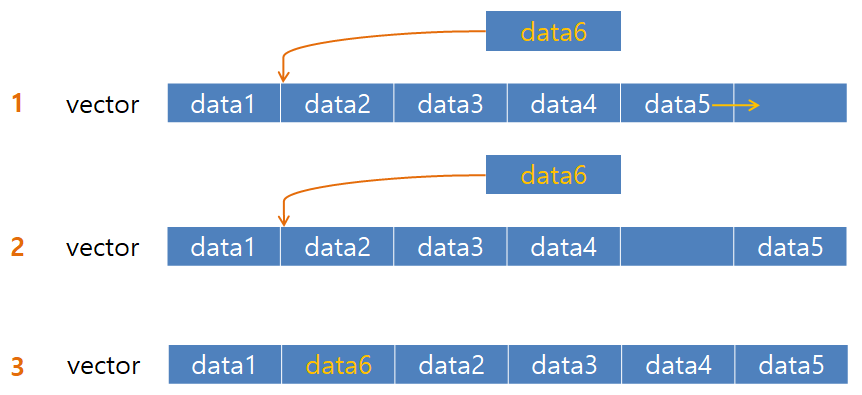
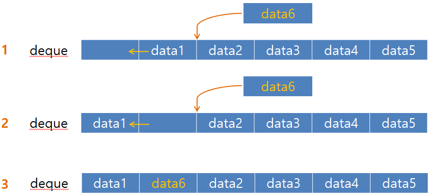
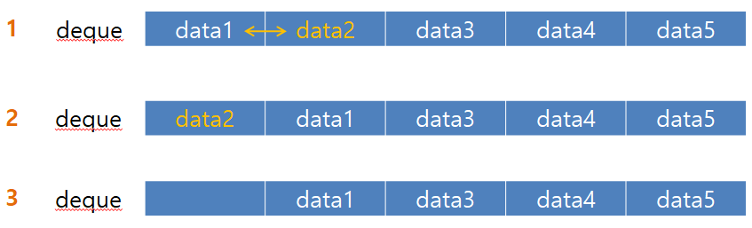
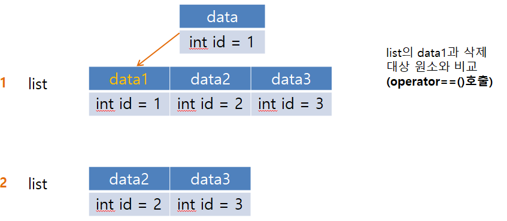
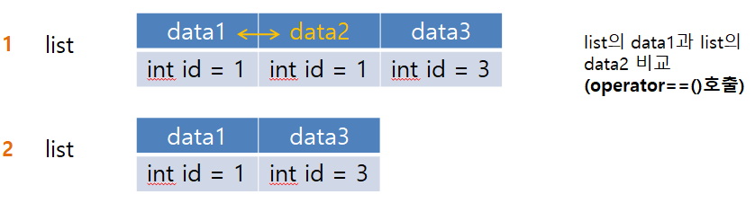
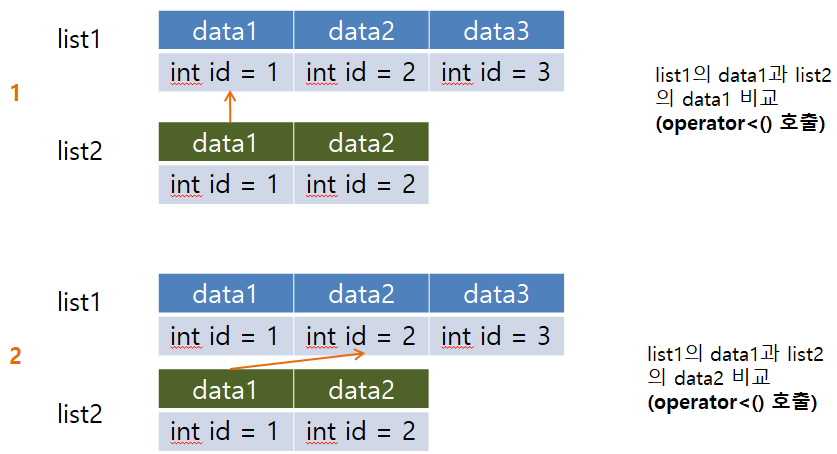

# C++ 컨테이너 동작

Vector, Deque, List의 동작을 살펴보자.
추가로 컨테이너는 빈번이 일어나는 행위에 알맞게 선택하여 사용하는 것이 효율적이다.

## Vector

### 삽

- `capacity` >= 6, Vector에 `insert()`를 이용하여 중간 삽입

    2에서 3으로 넘어갈 때마지막 원소부터 새로운 원소가 들어가는 인덱스까지 순서대로 뒤로 밀어낸다.(모든 원소 복사 생성자, data.operator=()를 호출)

    

- `capacity` >= 6, Vector에 `push_back()`을 이용하여 삽입

    2 맨뒤에 삽입한다.(복사 생성자 호출)

- `capacity` < 6, Vector에 `insert()`, `push_back()`을 이용하여 삽입

    2 모든 원소를 다른 장소에 옮긴다.(모든 원소 복사 생성자 호출)

### 삭제

- `pop_back()`를 이용한 삭제

    2 맨 뒤의 원소 삭제(소멸자 호출), capacity는 삭제 전과 같다.

- `erase()`를 이용한 중간 삭제

    2 삭제할 원소를 뒤로 밀어낸다.(operator=(), 복사 생성자 호출)

    3 마지막 인덱스에 도착하면 삭제한다.

## Deque

### 삽입

- `insert()` 중간 삽입

    2 원소 이동 비용이 가장 작은 경로를 선택 후, 이동할 원소 앞 혹은 뒤로 하나씩 밀어낸다.(data.operator=() 호출)

    

### 삭제

- `erase()` 중간 삭제

    2 원소 이동 비용이 가장 작은 경로를 선택 후, 이동할 원소를 앞 혹은 뒤로 하나씩 밀어낸다.(data.operator=() 호출)

    3 밀어낸 후, 삭제

    

## List

### 삭제

- `remove()` 를 이용한 삭제

    1 번 과정이 반복되어 remove가 완료(2)된다.

    

- `unique()`를 이용한 중복 원소 제거

    1 번 과정이 반복되어 unique가 완료(2) 된다.

    **앞뒤 요소가 아닌 떨어져있는 요소끼리는 중복 제거가 불가**

    

- `merge()`를 이용한 두 리스트 병합(`list1.merge(list2)`)

    1~2 번 과정이 반복되어 merge가 완료(4) 된다.

    

    
