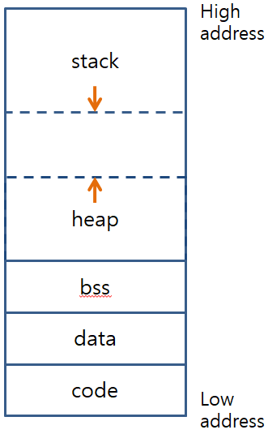

# C/C++ 메모리 구조

## 메모리 영역 설명

메모리 영역은 그림으로 나타내면 아래와 같다.



### Code 영역

- 실행 코드, 전역상수, static 전역상수 부분
- 이 영역의 정보는 read only로서 절대 변경되지 않아야 한다.
- 컴파일할 때, 크기가 정해진다.

### Data & Bss 영역

- Data 영역은 초기화된 static, 초기화된 전역변수 부분
- Bss 영역은 초기화되지 않은 전역변수, 0으로 초기화된 전역변수, 초기화되지 않은 static 변수, 0으로 초기화된 static 변수가 올라오는 부분
- Bss 영역에 올라오는 모든 변수는 0으로 초기화된다.
- 컴파일할 때, 크기가 정해진다.

### Heap 영역

- 동적으로 할당해준 변수(malloc, new)가 올라오는 부분
- 먼저 들어간 데이터가 가장 먼저 나온다.(FIFO)
- 실행할 때, 크기가 정해진다.

### Stack 영역

- 임시적으로 생성해준 변수(지역 변수)가 올라오는 부분
- 먼저 들어간 데이터가 가장 나중에 나온다.(FILO)
- 실행할 때, 크기가 정해진다.

## 변수 및 함수의 종류에 따른 메모리 주소 출력 예제

각 변수 및 함수의 주소를 출력하여 비교

- 실행

```
$ ./a.out
-------------------------------- code --------------------------------------
printf                            addr  : 0x4005b8
Init	  global  const	        int addr  : 0x400c10
Init	  main	  const	static	int addr  : 0x400c18
Init	  global	const	static	int addr  : 0x400c14
-------------------------------- data --------------------------------------
Init  	global		            int addr  : 0x600fcc
Init  	global        static	int addr  : 0x600fd0
Init  	main		      static	int addr  : 0x600fd4
-------------------------------- bss ---------------------------------------
Zero	  global			          int addr	: 0x600fe8
Uninit	global			          int addr  : 0x600fec
Uninit	global		   static  	int addr  : 0x600ff4
Uninit	main		     static 	int addr  : 0x600ff8
-------------------------------- stack -------------------------------------
Init	  main			            int addr  : 0x7fff3605609c
Init	  main	const	      	  int addr  : 0x7fff36056098
Uninit	main			            int addr  : 0x7fff36056094
--------------------------------- heap -------------------------------------
New	main                      int addr1 : 0x7fff36056088
New	main			                int addr2 : 0x7fff36056080
```

## 함수에서의 메모리 할당 예제

```c
void fct1(int c) {
    int d = 30;
    /* fct1 함수의 지역변수 d, 매개변수 c  출력*/
    printf("d addr : %p, c addr : %p\n", &d, &c);
}

void fct2(int e) {
    int f = 40;
    /* fct2 함수의 지역변수 f, 매개변수 e  출력 */
    printf("f addr : %p, e addr : %p\n", &f, &e);
}

int main()
{
    int i = 100;
    fct1(i);
    fct2(i);
    return 0;
}
```

위의 코드를 출력하면 아래와 같은 결과 가 나온다.

살펴보면 `fct1`의 매개변수, 지역변수가 해제된 후 `fct2`의 매개변수, 지역변수가 같은 주소로 메모리가 할당된다.

```
$ ./a.out
d addr : 0x7ffe966004ac, c addr : 0x7ffe9660049c
f addr : 0x7ffe966004ac, e addr : 0x7ffe9660049c
```
