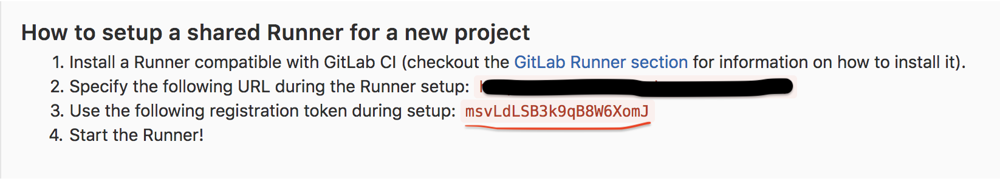

# Gitlab-CI를 이용한 Docker In Docker 배포

이전에는 Gitlab은 소스코드 관리, Jenkins는 CI/CD를 용도로 사용했다.
하지만 Gitlab-CI가 있다는 걸 알게 되어 소스코드관리와 CI/CD를 같이하면 가독성이 높아질거라 생각하여 이번에 도입하게 되었다.

---

## docker를 이용한 gitlab-runner 설치

- [docker 설치](https://docs.docker.com/install/)
- [docker-compose 설치](https://docs.docker.com/compose/install/#install-compose)
- gitlab-runner 설치

아래와 같은 docker-compose.yml를 준비한다.

```yaml
version: '3'
services:
  gitlab-runner-tmpdir:
    restart: always
    image: gitlab/gitlab-runner
    container_name: gitlab-runner-tmpdir
    volumes:
      # gitlab-runner 설정 파일 경로
      - /app/gitlab-runner-tmpdir/config:/etc/gitlab-runner
      - /var/run/docker.sock:/var/run/docker.sock
```

`docker-compose.yml` 가 있는 경로에서 `docker-compose up -d`를 실행한다.

## gitlab-runner gitlab에 등록

자신의 gitlab 홈페이지 에서 gitlab-ci token 확인한다.
gitlab의 Admin Area → Overview -> Runners 에서 확인할 수 있다.



gitlab-runner가 설치 되어있는 장비에서 아래의 명령어를 실행한다.

```bash
$ docker exec -it gitlab-runner-tmpdir bash
$ sudo gitlab-runner register 

Running in system-mode.                            
Please enter the gitlab-ci coordinator URL (e.g. https://gitlab.com/):
<GITLAB URL>

Please enter the gitlab-ci token for this runner:
<GITLAB-CI TOKEN>

Please enter the gitlab-ci description for this runner:
[4df7934fb677]: <RUNNER DESC>

Please enter the gitlab-ci tags for this runner (comma separated):
<RUNNER TAG>

Whether to run untagged builds [true/false]:
[false]: 

Whether to lock the Runner to current project [true/false]:
[true]: 
Registering runner... succeeded                     runner=msvLdLSB

Please enter the executor: ssh, docker+machine, docker-ssh+machine, kubernetes, docker, docker-ssh, virtualbox, parallels, shell:
docker

Please enter the default Docker image (e.g. ruby:2.1):
/* 해당 프로젝트는 java를 사용하기 때문에 java:8 이미지로 설정한다. */
java:8
Runner registered successfully. Feel free to start it, but if it's running already the config should be automatically reloaded!
```

docker in docker 배포를 위해 gitlab-runner 설정을 수정한다.

```bash
$ vi /app/gitlab-runner-tmpdir/config/config.toml
concurrent = 1
check_interval = 0

[[runners]]
  name = "****"
  url = "<GITLAB URL>"
  token = "88************"
  executor = "docker"
  [runners.docker]
    tls_verify = false
    image = "java:8"
    privileged = true // false -> true 수정
    disable_cache = false
    volumes = ["/cache"]
    shm_size = 0
  [runners.cache]
```

등록된 gitlab-runner를 확인 후 CI/CD 가 필요한 프로젝트와 연동한다.
gitlab의 Admin Area -> Overview -> Runners 에서 등록된 runner를 클릭하여 왼쪽 하단에 있는 프로젝트 리스트에서 해당 프로젝트를 Enable한다.

## .gitlab-ci.yml 작성

아래는 stage 장비에 배포하기 위한 `gitlab-ci.yml`이다.
project의 base 경로에 위치 해야한다.

```yaml
image: java:8

# 모든 단계에서 실행하는 script
before_script:
  # gradlew를 사용하기 위함
  - chmod +x gradlew
  # gradle에 설정된 값을 읽어오는 스크립트
  - export PACKAGE_NAME=$(./gradlew properties | grep name | awk '{print $2}' | tr -d '\n')
  - export PACKAGE_NAME_LOW=$(./gradlew properties | grep name | awk '{print $2}' | tr -d '\n' | sed -e 's/./\L\0/g')
  - export PACKAGE_VERSION=$(./gradlew properties | grep version | awk '{print $2}' | tr -d '\n')
  - export IMAGE_NAME=tmpdir-$PACKAGE_NAME_LOW-$PACKAGE_VERSION

stages:
  - build
  - test
  - build-docker
  - deploy-stage

build:
  stage: build
  script:
    - ./gradlew build
  # develop branch에 push 했을 때만 해당 stage를 실행
  only:
  - develop

sonarqube:
  stage: test
  # 네트워크 상태 실패를 대비한 시도 횟수 설정
  retry: 2
  script:
    - ./gradlew check sonarqube
  only:
    - develop

build_docker_image:
  stage: build-docker
  retry: 2
  variables:
    REGISTRY_HOST: <REGISTRY HOST>
    REGISTRY_USER: <REGISTRY HOST>
    REGISTRY_PASSWORD: <REGISTRY_PASSWORD>
  script:
    # docker를 설치하고 실행하기 위한 스크립트
    - apt-get update && apt-get install -y apt-transport-https ca-certificates curl gnupg2 software-properties-common && curl -fsSL https://download.docker.com/linux/$(. /etc/os-release; echo "$ID")/gpg | apt-key add - && apt-key fingerprint 0EBFCD88 && add-apt-repository "deb [arch=amd64] https://download.docker.com/linux/$(. /etc/os-release; echo "$ID") $(lsb_release -cs) stable" && apt-get update && apt-get install -y docker-ce && service docker start
    - ./gradlew build
    - docker build -t $REGISTRY_HOST/$IMAGE_NAME --build-arg PACKAGE_NAME=$PACKAGE_NAME --build-arg PACKAGE_VERSION=$PACKAGE_VERSION .
    # docker registry에 push 하기 위한 스크립트
    - docker login -u $REGISTRY_USER -p $REGISTRY_PASSWORD $REGISTRY_HOST
    - docker push $REGISTRY_HOST/$IMAGE_NAME
  only:
    - develop

deploy_stage:
  stage: deploy-stage
  retry: 2
  variables:
    REGISTRY_HOST: <REGISTRY HOST>
    REGISTRY_USER: <REGISTRY HOST>
    REGISTRY_PASSWORD: <REGISTRY_PASSWORD>
    ENV_PHASE: "stage"
  script:
    - apt-get update && apt-get install sshpass
    - sshpass -p '<SSH_PASSWORD>' ssh -T -oStrictHostKeyChecking=no -p 22000 <SSH_USER>@<SSH_HOST> "docker rm -f $IMAGE_NAME-$ENV_PHASE 2> /dev/null | echo ok && docker login -u $REGISTRY_USER -p $REGISTRY_PASSWORD $REGISTRY_HOST && docker pull $REGISTRY_HOST/$IMAGE_NAME && docker run -d -e ENV_PHASE='$ENV_PHASE' -v /app/tmpdir-fileupload/config:/app/config -v /etc/letsencrypt:/app/certs -v /applog/tmpdir-fileupload-$ENV_PHASE:/applog -v /db/tmpdir-$ENV_PHASE/storage:/storage --name $IMAGE_NAME-$ENV_PHASE $REGISTRY_HOST/$IMAGE_NAME"
  only:
  - develop
```
