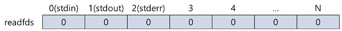

# Java Network Programming (3) - Selector

### 개요

NIO Non-Blocking Socket를 이용하여 하나의 스레드에서 여러 Socket를 처리할 수 있도록 도와주는 클래스이다.

### 목적

기존 IO Socket에서는 사용하여 스레드에서 읽기, 쓰기를 할 때 Blocking이 되어 하나의 스레드당 하나의 Socket(Client)뿐이 처리할 수 밖에 없었다.
하지만 NIO Socket(Channel)와 Selector를 사용하여 Event 기반(Writeable, Readable, Acceptable, Connectable)으로 한 쓰레드 당 여러 Channel를 처리할 수 있다.

### Flow

1. Selector 생성

    ```java
    Selector selector = Selector.open();
    ```

2. channel을 Selector에 등록

    ```java
    ServerSocketChannel ssc = ServerSocketChannel.open();
    ssc.configureBlocking(false);
    ServerSocketChannel.bind(new InetSocketAddress(port));
    ssc.register(selector, SelectionKey.OP_ACCEPT);
    ```

3. 사용 가능할 때 사용하기 위한 채널을 선택

    ```java
    int keyCount = selector.select();
    if(keyCount == 0) continue;
    /* 선택된 키셋 얻기 */
    Set<SelectionKey> selectedKeys = selector.selectedKeys();
    Iterator<SelectionKey> iterator = selectedKeys.iterator();

    while (iterator.hasNext()) {
      SelectionKey selectionKey = iterator.next();

      if (selectionKey.isAcceptable()) { /* accept 작업 처리 */ }
      else if (selectionKey.isReadable()) { /* read 작업 처리 */}
      else if (selectionKey.isWritable()) { /* write 작업 처리 */ }
      else { /* 예외 처리 */ }

      /* 이후에 selectedKeys에 현재 selectedKey가 남아 있는 것을 지우기 위함 */
      iterator.remove();
    }
    ```

### Select(system call) Flow

socket1을 readfds(읽기가능한 fd 그룹)에 등록을 한다고 가정한 뒤, readabie 상태가 됐을 때 select가 처리하는 흐름을 아래와 같이 보여준다.

1. 초기

    

2. select에 등록

    

3. select는 등록된 fd에 이벤트가 일어났는지 확인
4. socket1(fd 3)에 데이터가 수신
5. select는 fd 3(socket1)에 해당하는 영역을 1로 변환 후 반환한다.

    

### 주요 클래스
|Selector            |Selector 기본 기능을 제공한다.|
|--------------------|---------------------|
|SelectionKey        |처리를 위해 준비된 이벤트의 타입을 식별한다.|


### Selector

|이름                  |반환값               |설명                                                                                             |
|--------------------|------------------|-----------------------------------------------------------------------------------------------|
|open()              |Selector          |selector를 open한다.                                                                              |
|close()             |Selector          |selector를 close한다. close 한 후, close된 Selector에 대해서 method를 사용한다면, ClosedSelectorException를 던진다.|
|isOpen()            |boolean           |selector open 유무를 반환한다.                                                                        |
|keys()              |Set\<SelectionKey>|selector의 key set을 반환한다. 직접적으로 Key Set를 변경하려 하면 UnsupportedOperationException 던진다.             |
|selectedKeys()      |int               |selector의 selected-key set를 반환한다.                                                              |
|select()            |int               |최소한 하나의 채널이 작업처리 준비가 될 때까지 blocking된다.                                                         |
|select(long timeout)|int               |select와 동일하지만, 주어진 시간동안 blocking 한다.                                                           |
|selectNow()         |int               |호출 즉시 반환한다. 작업 처리가 준비된 채널이 있으면 채널 수를 반환하고 없다면 0을 반환한다.                                         |
|wakeup()            |Selector          |select가 즉시 반환된다.                                                                               |


### SelectionKey

- 속성

|이름                  |타입                |설명                    |
|--------------------|------------------|----------------------|
|OP_ACCEPT           |static int        |socket accept에 대한 bit |
|OP_CONNECT          |static int        |socket connect에 대한 bit|
|OP_READ             |static int        |read에 대한 bit          |
|OP_WRITE            |static int        |write에 대한 bit         |

- 메소드

|이름                  |반환값               |설명                                                                                             |
|--------------------|------------------|-----------------------------------------------------------------------------------------------|
|attach(Object ob)   |Object            |채널 등록시 함께 등록할 객체를 지정한다.                                                                        |
|attachment()        |Object            |attach()로 등록된 객체를 반환한다.                                                                        |
|cancel()            |void              |해당 SelectionKey를 Selector에서 삭제한다. 취소된 Key 집합에 포함된다.                                            |
|channel()           |SelectableChannel |연관있는 등록된 채널을 반환한다.                                                                             |
|interestOps()       |int               |관심있는 OP_*를 반환한다.                                                                               |
|interestOps(int ops)|SelectionKey      |관심있는 OP_*를 등록한다.                                                                               |
|isAcceptable()      |boolean           |accptable 유무를 반환한다.                                                                            |
|isConnectable()     |boolean           |connectable 유무를 반환한다.                                                                          |
|isReadable()        |boolean           |readable 유무를 반환한다.                                                                             |
|isWriteable()       |boolean           |Writeable 유무를 반환한다.                                                                            |
|isValid()           |boolean           |유효한 Key 유무를 반환한다.                                                                              |
|readyOps()          |int               |준비된 OP_*를 반환한다.                                                                                |
|selector()          |Selector          |연관된 Selector를 반환한다.                                                                            |
