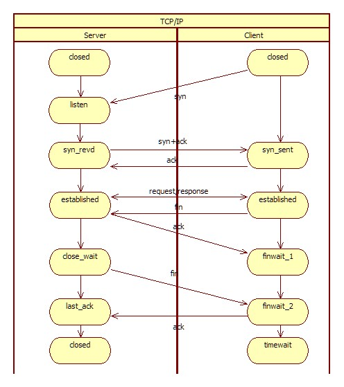
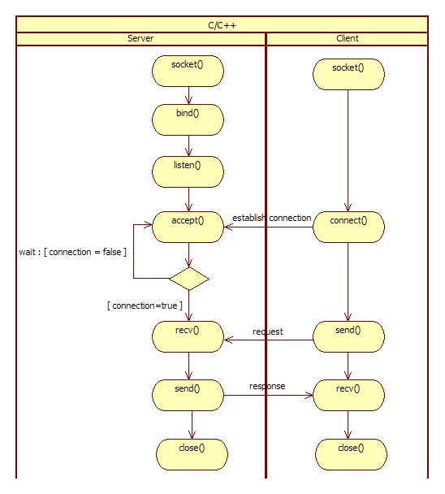
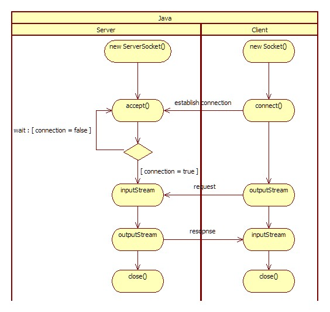

# Java Network Programming(1) - Socket

### 흐름

- TCP 통신

    

- C/C++

    

- Java

    

### Java 코드

- Client

```java
Socket socket = new Socket();
socket.connect(new InetSocketAddress(host, port));

/* send "REQ" */
byte[] writeBuf = {'R', 'E', 'Q'};
socket.getOutputStream().write(writeBuf, 0, writeBuf.length);

/* recv byte */
byte[] readBuf = new byte[16];
socket.getInputStream().read(readBuf, 0, readBuf.length);

socket.close();
```

- Server

```java
ServerSocket serverSocket = new ServerSocket(6000);
Socket socket = serverSocket.accept();

/* recv byte */
byte[] readBuf = new byte[16];
socket.getInputStream().read(readBuf, 0, readBuf.length);

/* send "RES" */
byte[] writeBuf = {'R', 'E', 'S'};
socket.getOutputStream().write(writeBuf, 0, writeBuf.length);

serverSocket.close();
```
