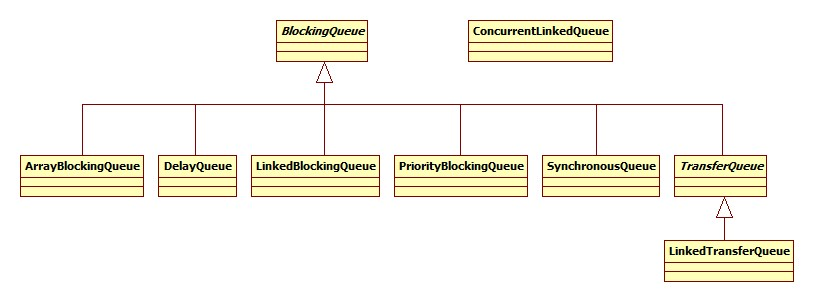

# Java Thread Safe Queue

### thread-safe한 큐들의 관계

## BlockingQueue 인터페이스

- 내부 lock이나 다른 병행을 이용한 thread-safe queue 인터페이스
- 주요 사용은 생성자-소비자 큐로 사용된다. 생성자-소비자 개념은 [생성자-소비자 패턴](http://zeroit.tistory.com/entry/%EC%83%9D%EC%84%B1%EC%9E%90-%EC%86%8C%EB%B9%84%EC%9E%90-FIFO-%ED%81%90-Thread)를 참고
- 하위 클래스로는 `ArrayBlockingQueue`, `DelayQueue`, `LinkedBlockingDeque`, `LinkedBlockingQueue`, `LinkedTransferQueue`, `PriorityBlockingQueue`, `SynchronousQueue` 가 있다.
- 하위 인터페이스로는 `BlockingDeque<E>`, `TransferQueue<E>`가 있다.
- 주요 메소드
메소드 행위에 대해 즉각적으로 만족하지 못하는 경우에 발생하는 결과를 포함한 메소드 분류는 [java.util.concurrent.BlockingQueue<E>의 Summary of BlockingQueue methods](https://docs.oracle.com/javase/8/docs/api/java/util/concurrent/BlockingQueue.html)를 참고
- 주요 특징
    - null을 삽입할 수 없다. 삽입관련 method는 모두 `NullPointerException`를 발생시킨다.
    - 용량(capacity)가 제한되어 있다. 기본값은 `Interger.MAX_VALUE`(2147483647)이다. 용량이 꽉차있을 경우, `put()`를 호출하면 넣을 공간이 있을 때까지(용량이 꽉차지 않았을 때까지) Block한다.
      
      
    |구분                   |ArrayBlockingQueue|DelayQueue|LinkedBlockingQueue|PriorityBlockingQueue|SynchronousQueue|LinkedTransferQueue|ConcurrentLinkedQueue|
    |---------------------|------------------|----------|-------------------|---------------------|----------------|-------------------|---------------------|
    |Blocking/Non-blocking|Blocking          |Blocking  |Blocking           |Blocking             |Blocking        |Blocking           |Non-blocking         |
    |capacity 제한          |유                 |무         |유/무                |무                    |-               |무                  |무                    |
    |기본 정렬방법              |FIFO              |-         |FIFO               |Natural ordering     |-               |FIFO               |FIFO                 |

### ArrayBlockingQueue 클래스

- 제한이 있는 blocking 기본 행렬 기반 큐
- FIFO(first-in-first-out)
- 처음 생성할 때, capacity를 설정하고 추후에 capacity를 변경할 수 없다.
- 생성할 때, fairness 인자값에 true를 입력하지 않으면 FIFO는 보장할 수 없다. 기본적으로 FIFO는 처리량을 감소시키기 때문에 기본값은 false이다.

### DelayQueue 클래스

- 제한이 없는 blocking 큐
- Delayed 인터페이스를 상속받은 클래스의 객체만 넣을 수 있다.
- delay가 만료된 객체만 삭제할 수 있다.

### LinkedBlockingQueue 클래스

- 제한을 설정할 수 있는 blocking 링크 노드 기반 큐
- FIFO(first-in-first-out)

### TransferQueue 인터페이스

- `transfer` 메소드를 사용하면 소비자가 element를 받을 때 까지 생성자는 기다린다.
- `tryTransfer` 메소드를 사용하면 Non-blocking, time-out 버전의 transfer를 사용할 수 있다. element를 받을 생성자가 없으면 false를 반환하거나 일정 시간 동안 element를 받을 생성자가 없으면 false를 반환한다.
- 메모리 일관성

### LinkedTransferQueue 클래스

- 제한 없는 링크 노드 기반 TransferQueue
- FIFO(first-in-first-out)
- `size` 함수는 현재 큐의 element 개수를 정확히 알려주지 않는다. `addAll`, `removeAll`, `retainAll`, `containsAll`, `equals`, `toArray` 또한 원자적으로 행동하지 않으므로 보장할 수 없다.

### PriorityBlockingQueue 클래스

- 제한 없는 non-blocking 큐
- 기본적으로 `PriorityQueue`의 정렬([natural ordering](https://docs.oracle.com/javase/tutorial/collections/interfaces/order.html))를 따른다. 임의로 정렬 기준을 만들어서 적용할 수도 있다.

### SynchronousQueue 클래스

- 저장 공간이 없다.
- 받아갈 소비자가 없으면 생성자에서 삽입을 blocking한다.
- 생성자에서 소비자로 데이터가 넘어갈 때 빠르다.

## ConcurrentLinkedQueue 클래스

- 제한이 없는 non-blocking 링크 노드 기반 큐
- FIFO(first-in-first-out)
- `size` 함수는 현재 큐의 element 개수를 정확히 알려주지 않는다. `addAll`, `removeAll`, `retainAll`, `containsAll`, `equals`, `toArray` 또한 원자적으로 행동하지 않으므로 보장할 수 없다.
- 메모리 일관성
