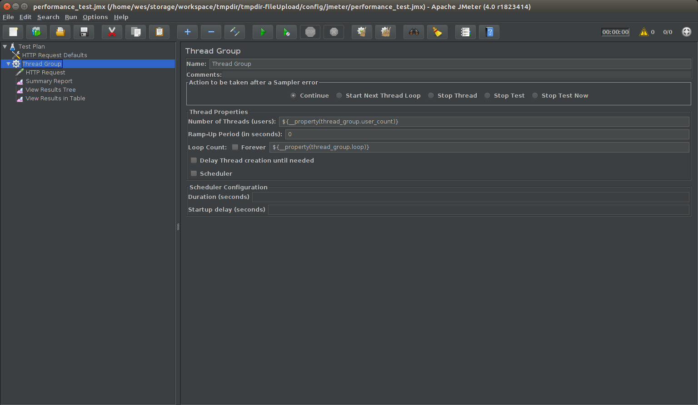
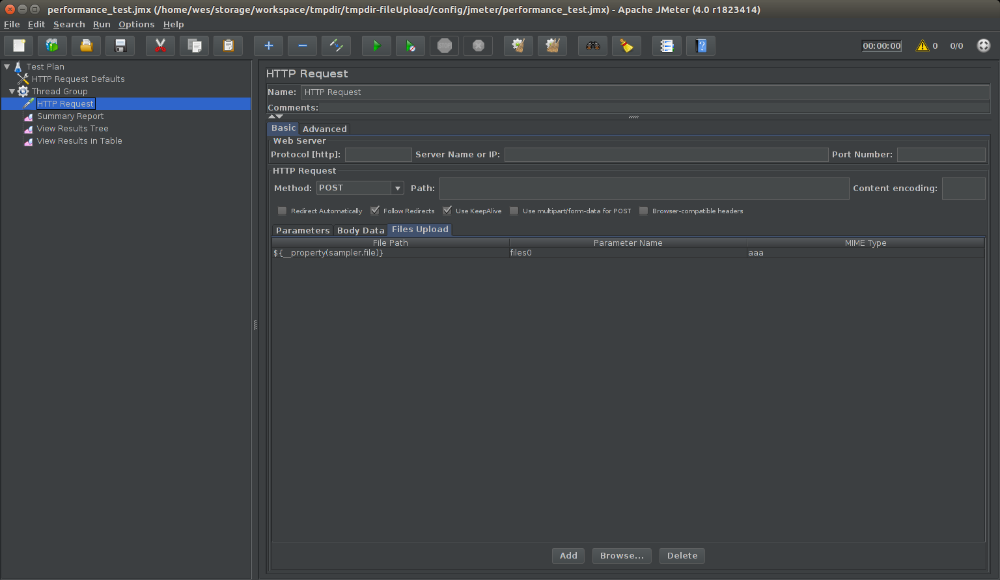

# Jenkins Jmeter 연동

아래 예제는 파일 업로드 서비스를 테스트한 것이다.

### Jmeter jmx 파일 생성

jmeter를 실행하여 테스트할 서비스의 호스트, 포트, 스레드 그룹 등을 설정한다.

`${__property(XXXXXX)}` 는 Properties 파일에서 가져오는 변수명이다. 아래에서 설명한다.

- Thread Group

    

- Http Sampler

    

    설정을 마치고 툴바의 저장 버튼을 눌러 jmx 파일를 저장한다.

### Properties 생성

jmeter 실행 옵션을 다르게 하여 테스트 할 때마다 파일 크기를 조정하기 위해서 properties를 만든다.

```
$ vi config/jmeter/tmpdir.properties

# properties 파일 기준의 base 경로
# 주로 sampler, report 경로를 지정하기 위해 쓰인다.
jmeter.save.saveservice.base_prefix=../../

# jenkins Performance Plugin와 연동하기 위한 데이터
jmeter.save.saveservice.output_format=xml
jmeter.save.saveservice.data_type=true
jmeter.save.saveservice.label=true
jmeter.save.saveservice.response_code=true
jmeter.save.saveservice.successful=true
jmeter.save.saveservice.thread_name=true

# 사용자 정의 데이터
sampler.protocol=http
sampler.host=file-uploader.com
sampler.port=123

# sampler에서 사용할 파일
sampler.file=data/test/mb.txt

thread_group.user_count=1000
thread_group.loop=10

listener.summary_report.path=build/jmeter/summary_report_gb.xml
listener.view_results_tree.path=build/jmeter/view_results_tree_gb.xml
listener.view_results_in_table.path=build/jmeter/view_results_in_table_gb.xml
```

- Properties와 jmx 맵핑

```xml
$ vi config/jmeter/performance_test.jmx

<?xml version="1.0" encoding="UTF-8"?>
<jmeterTestPlan version="1.2" properties="4.0" jmeter="4.0 r1823414">
...
  <!-- 위의 properties 파일에서 변수에 해당하는 값을 가지고 온다. ${__property(변수명)}-->
  <stringProp name="HTTPSampler.domain">${__property(sampler.host)}</stringProp>
  <stringProp name="HTTPSampler.port">${__property(sampler.port)}</stringProp>
  <stringProp name="HTTPSampler.protocol">${__property(sampler.protocol)}</stringProp>
...
</jmeterTestPlan>
```

### Jenkins 서버에 Jmeter 설치

[Jmeter 다운로드](https://jmeter.apache.org/download_jmeter.cgi)를 하고 jenkins 서버의 적절한 위치에 설치한다.
그리고 PATH를 설정하여 jmeter 명령어를 사용할 수 있게 한다.

### Jenkins Performance Plugin 설치

Jenkins 플러그인 설치 페이지에서 [Performance Plugin](https://wiki.jenkins.io/display/JENKINS/Performance+Plugin)를 설치한다.

### `jenkinsfile.groovy`(pipeline 파일) 설정

```groovy
$ vi jenkinsfile.groovy

...
stage "Performance testing"
  /* 
    jmeter를 실행.
    jmeter -n -t <jmx 경로> -p <Properties 경로> -J<Properties 변수>=<값> -l <jtl 경로>
  */
  sh "mkdir -p ./build/jmeter && /var/jenkins_home/thrid-party/apache-jmeter-4.0/bin/jmeter -n -t config/jmeter/performance_test.jmx -p config/jmeter/tmpdir.properties -l build/jmeter/preformance_test_report_mb.jtl -Jsampler.file=data/test/mb.txt -Jlistener.summary_report.path=build/jmeter/summary_report_mb.xml -Jlistener.view_results_tree.path=build/jmeter/view_results_tree_mb.xml -Jlistener.view_results_in_table.path=build/jmeter/view_results_in_table_mb.xml"
  /* 10mb 파일을 만들어주는 쉘 스크립트 */
  sh "chmod +x ./script/util/make-10mb-file.sh && script/util/make-10mb-file.sh"
  sh "mkdir -p ./build/jmeter && /var/jenkins_home/thrid-party/apache-jmeter-4.0/bin/jmeter -n -t config/jmeter/performance_test.jmx -p config/jmeter/tmpdir.properties -l build/jmeter/preformance_test_report_10mb.jtl -Jsampler.file=data/test/10mb.txt -Jlistener.summary_report.path=build/jmeter/summary_report_10mb.xml -Jlistener.view_results_tree.path=build/jmeter/view_results_tree_10mb.xml -Jlistener.view_results_in_table.path=build/jmeter/view_results_in_table_10mb.xml"
  /* 1gb 파일을 만들어주는 쉘 스크립트 */
  sh "chmod +x ./script/util/make-gb-file.sh && script/util/make-gb-file.sh"
  sh "mkdir -p ./build/jmeter && /var/jenkins_home/thrid-party/apache-jmeter-4.0/bin/jmeter -n -t config/jmeter/performance_test.jmx -p config/jmeter/tmpdir.properties -l build/jmeter/preformance_test_report_gb.jtl"
  /*
    performance plugin 사용
    perfReport '<jtl 경로>'
  */
  perfReport 'build/jmeter/*.jtl'
  /* 나머지 report 다운 받기 위해 사용 */
  step([$class: 'ArtifactArchiver', artifacts: 'build/jmeter/*.xml', fingerprint: true])
...
```
