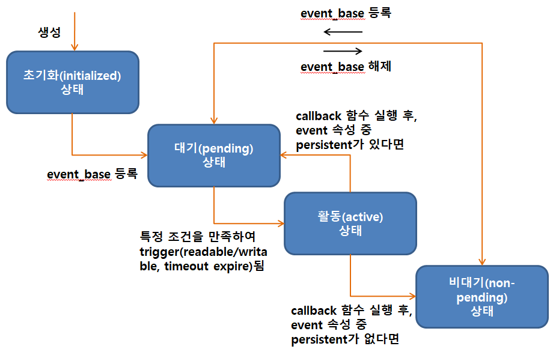
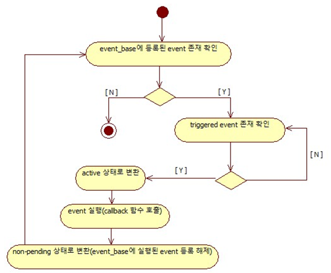
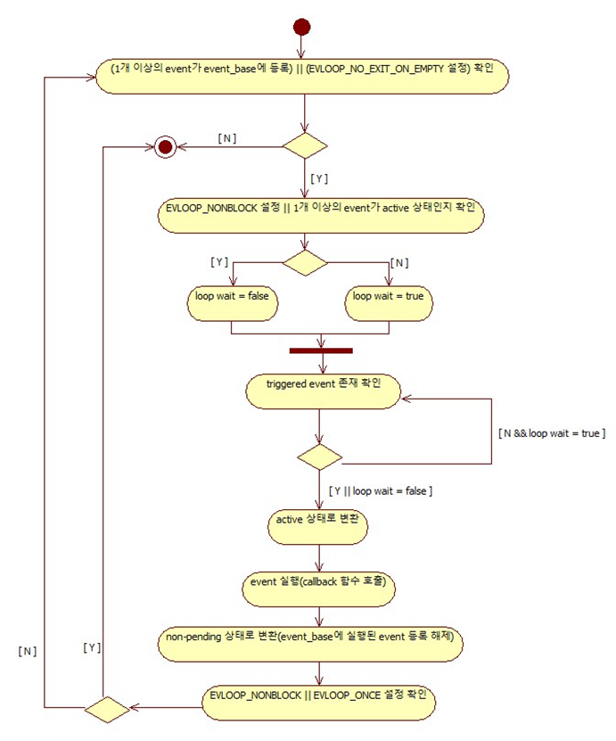

# Libevent 기초

## 개요

- 각각의 요청을 실제로 처리하기 위해, `libevent` 라이브러리는 기본 네트워크 백엔드 주위에서 랩퍼 역할을 하는 이벤트 메커니즘을 제공한다
- 이벤트 시스템을 사용하면 기본 I/O 복잡성을 간소화하는 한편, 연결을 위한 핸들러를 매우 쉽고 간단하게 추가할 수 있다.
- `libevent` 라이브러리가 실제로는 `select()`, `poll()` 또는 다른 메커니즘의 기초를 대체하지는 못한다.

## 주요 구성요소

- `event` : 특정 조건에서 발생되는 사건
- `event_base` : `event`들을 관리하기 위한 구조체

## `event_base`

- `libevent`를 사용하기 전, 하나 혹은 그 이상의 `event_base_structure`를 생성해야 한다. 각각의 `event_base_structure`는 설정된 이벤트를 감시하며, Poll 한다.
- 만약 `event_base`가 Locking 을 사용한다면 멀티 스레드 환경에서도 안전하게 사용이 가능하지만, 만약 사용하지 않는다면 반드시 싱글 스레드 환경에서만 사용해야 한다.
- 각각의 `event_base`는 어떤 이벤트들이 준비됐는지 확인하기 위해 "메소드" 혹은 "백엔드"를 사용한다.
- 메소드(백엔드)의 종류
    - `select`
    - `poll`
    - `epoll`
    - `kqueue`
    - `devpoll`
    - `evport`
    - `win32`

### `event_base` 생성

```c
struct event_base *event_base_new(void);
```

- `event_base_new()` 함수는 `event_base`를 기본 설정 상태로 생성하고 반환한다.
- 만약 여러 개의 메소드가 있다면, 동작 OS에서 가장 빨리 작동하는 메소드를 자동으로 선택한다.
- 반환값은 성공하면 새로 생성한 `event_base` 포인터를 반환하고 에러가 발생하면 NULL을 반환한다.

### `event_base` 해제

```c
void event_base_free(struct event_base *base);
```

- `event_base`의 사용이 끝났다면, `event_base_free()` 함수를 통해 메모리를 해제해주어야 한다.
- 매개 변수 설명
    - `*base` : 메모리 해제할 `event_base`
- 반환값은 없다.
- 이 함수를 사용한다고 해서 `event_base`와 연동된 다른 오브젝트들 까지 메모리 해제가 되는 것이 아니며, 소켓을 종료하는 것이 아니다.

## `event`

- libevent의 기본 실행 단위.
- 이벤트의 상태 종류
    - file descriptor의 read/write 준비 완료
    - file descriptor의 read/write 준비 중(Egde-triggered1) IO Only)
    - timeout 만료
    - signal 발생
    - 사용자 정의 trigger

### `event` 생명주기



### `event` 생성

```c
struct event *event_new(struct event_base *base, evutil_socket_t fd, short what, event_callback_fn cb, void *arg);
```

- 매개 변수 설명
    - `*base` : `event`가 포함될 `event_base`
    - `fd` : read/write 하고자 하는 file descriptor 값
    - `what` : flag set
    - `cb` : 함수 이벤트가 active 되면, 호출할 함수
    - `*arg` : cb 호출 시 cb로 넘겨줄 매개 변수
- 반환값은 성공하면 새로 생성된 `event` 포인터, 에러가 발생하면 NULL을 반환한다.
- 모든 이벤트는 생성 직후 초기화(initialized) 상태 혹은 non-pending 상태가 된다.
- flag set

|flag                   |설명                                                                                                              |
|-----------------------|----------------------------------------------------------------------------------------------------------------|
|EV_TIMEOUT             |event_add 함수에 같이 설장한 시간 뒤에 active 된다.                                                                           |
|EV_READ                |등록한 file descriptor가 Read 가능한 상태일 때 active 된다.                                                                  |
|EV_WRITE               |등록한 file descriptor가 Write 가능한 상태일 때 active 된다.                                                                 |
|EV_SIGNAL              |등록한 시그널이 감지될 때 active 된다.                                                                                       |
|EV_PERSIST             |해당 이벤트는 영구적임을 나타난다.                                                                                             |
|EV_ET                  |event_base 의 백엔드가 Edge-trigger 를 지원할 때, 해당 이벤트가 Edge-triggered 를 사용한다는 것을 나타낸다. EV_READ/EV_WRITE 의 Edge-trigger 버전이다.|

### `event` 해제

```c
void event_free(struct event *event);
```

- 매개 변수 설명
    - `*event` : 메모리 해제할 event
- 반환값은 없다.
- 해당 함수는 event가 pending이나 active 상태에서 호출해도 되지만, non-pending이나 inactive 상태에서 메모리 해제된다.

### `event`를 `event_base` loop에 추가

```c
int event_add(struct event *ev, const struct timeval *tv);
```

- pending 상태로 만들기 위해서 사용한다.
- 매개 변수 설명
    - `*ev` : pending 상태를 만들기 위한 `event`
    - `*tv` : 설정한 값의 시간(seconds, microseconds) 후에 active 된다.
- 반환값은 성공하면 0, 에러가 발생하면 -1를 반환한다.

### `event`를 `event_bass` loop에서 삭제

```c
int event_del(struct event *ev);
```

- non-pending 상태로 만들기 위해서 사용한다.
- 매개 변수 설명
    - `*ev` : non-pending 상태를 만들기 위한 event
- 반환값은 성공하면 0, 에러가 발생하면 -1를 반환한다.

## event loop 동작

### loop의 기본 흐름(flags 미포함)



|flag                   |설명                                                                                                              |
|-----------------------|----------------------------------------------------------------------------------------------------------------|
|EVLOOP_ONCE            |event_base 에 등록된 이벤트들중 하나 혹은 하나이상의 이벤트가 "active" 될 때까지 대기를 한다. 이후 active 된 이벤트를 실행한다. 실행할 active된 이벤트가 없으면 반환한다.|
|EVLOOP_NONBLOCK        |event_base 에 등록된 이벤트가 "trigger" 될 때까지 대기하지 않고 즉시 “trigger”된 이벤트만 확인한 후 active된 이벤트를 실행하고 반환한다.                  |
|EVLOOP_NO_EXIT_ON_EMPTY|event_base_loopbreak(), event_base_loopexit() 를 호출하거나 에러가 발생하지 않는 이상, 계속해서 루프를 돌게 된다.                           |

### loop 흐름(flags 포함)


